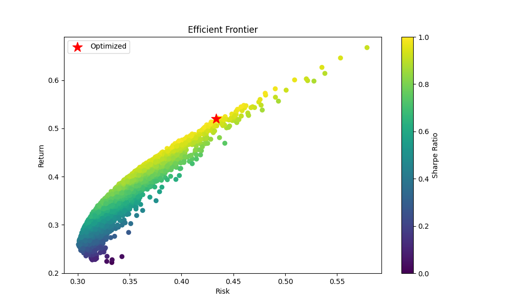

# Portfolio Optimization using Modern Portfolio Theory (MPT)

## 📌 Project Overview

This project applies Modern Portfolio Theory (MPT) to optimize a stock portfolio using Python.

The system:
- Downloads historical stock data
- Calculates portfolio returns and volatility
- Maximizes Sharpe Ratio
- Simulates thousands of portfolio combinations
- Visualizes the Efficient Frontier

The objective is to identify the optimal portfolio allocation that provides the best risk-adjusted return.

---

## 📚 Finance Concepts Used

- Modern Portfolio Theory (MPT)
- Diversification
- Risk vs Return
- Sharpe Ratio
- Portfolio Allocation
- Covariance Matrix
- Efficient Frontier

---

## 🛠 Technologies Used

- Python
- Pandas
- NumPy
- Matplotlib
- yFinance
- SciPy

---

## ⚙️ Project Workflow

1. Download stock market data using yFinance
2. Calculate daily returns
3. Compute portfolio risk and return
4. Optimize portfolio weights using Sharpe Ratio
5. Generate Efficient Frontier visualization
6. Analyze optimal portfolio allocation

---

## 📊 Results & Insights

- The optimized portfolio achieved better risk-adjusted returns compared to random allocations.
- Diversification reduced overall portfolio volatility.
- Sharpe Ratio optimization helped identify efficient asset allocation.
- The Efficient Frontier demonstrates the relationship between portfolio risk and expected return.
- Portfolio optimization improves decision-making by balancing returns with risk exposure.

## 📌 Sample Output

Expected Return: 18.4%  
Portfolio Risk: 12.1%  
Sharpe Ratio: 1.52

---

## 📈 Efficient Frontier Visualization

---

## 🚀 Future Improvements

- Add Monte Carlo Simulation
- Include Risk-Free Rate
- Compare Equal Weight vs Optimized Portfolio
- Build Interactive Dashboard using Streamlit
- Add Real-Time Portfolio Tracking

---

## 👨‍💻 Author

Parth Bhanushali
